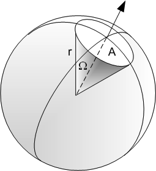
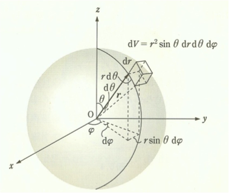
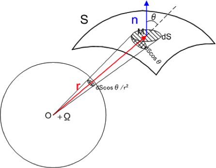
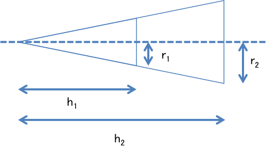

# Solid Angle

## 立体角の定義

空間上に半径1の球を考え,球の中心を頂点とするような円錐を考える.
この円錐によって切り取られる球面の面積のことを立体角と定義する.

## 全立体角

全立体角は以下のようになる

$$
\begin{aligned}
\int d\Omega &=\int^{2\pi}_{0}d\phi\int^{\pi}_{0}d\theta\sin\theta \\
&= 4\pi \, (\mathrm{str})
\end{aligned}
$$

$$
\begin{aligned}
d\Omega &=\frac{dS\cos{\theta}}{r^{2}} \\
&=\frac{r \cdot n}{r^{3}}dS 
\end{aligned}
$$

$\vec{r}$に垂直な円錐の底面の面積はOからの距離の2乗に比例するため$r^{2}$で割る.  
局面$S$全体の立体角は積分して以下の通りに得られる.  

$$
\begin{aligned}
\Omega &=\iint_{S}\frac{dS\cos{\theta}}{r^{2}} \\
&=\iint_{S}\frac{r \cdot n}{r^{3}}dS 
\end{aligned}
$$

### 中学生レベルのお話 

$$
r_{1} : r_{2} = h_{1} : h_{2}
$$

円錐の底面積の比は 
$$
S_{1} : S_{2} = r_{1} : r_{2} = h_{1} : h_{2}
$$

円錐の断面だと思え！！
