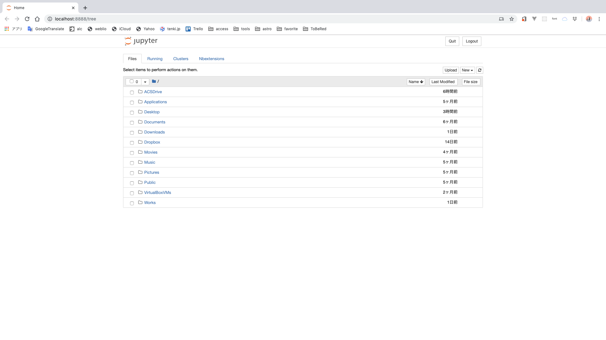

# Python環境構築

## pyenv

### Pyenvとは?

* 複数バージョンのpythonを簡単に管理できる。一つの環境内でバージョンの切り替えが簡単にできる。
* 色々なバージョンのpythonを$HOME/.pyenv以下に配置している。

### インストール

1. `git`のインストール
pyenv-installerを使用するには、`git`が必要なので、事前にインストールすること。
1. pyenv-installerでのpyenvのインストール
    ```shellscript
    % curl -L https://raw.githubusercontent.com/pyenv/pyenv-installer/master/bin/pyenv-installer | bash
    ```
3. 環境設定  
各shellのprofile(`$SHELL=/.../bash`の場合は、 `$HOME/.bashrc`, `$SHELL=/.../zsh`の場合は、 `$HOME/.zshrc`, `csh`,`tcsh`,`ksh`, etcはそれぞれ対応するファイル)に以下を追記する。
    ```
    export PYENVSYS=$HOME/.pyenv  
    export PATH=${PYENVSYS}/bin:$PATH  
    eval "$(pyenv init -)"  
    eval "$(pyenv virtualenv-init -)"  
    ```

### `pyenv` での python環境のインストール

1. 準備
ビルド時のよくある問題が[ここ](https://github.com/pyenv/pyenv/wiki/Common-build-problems) にまとまっているので、事前に自分の環境に合わせて必要なものをインストールすること。
1. インストール
    ```
    % pyenv install --list    # インストール可能なversionの一覧表示
    % pyenv install 3.7.4
    % pyenv global 3.7.4
    % eval "$(pyenv init -)"
    % pyenv versions
    system
    * 3.7.4 (set by /home/yyoshida/.pyenv/version)
    ```

### `pyenv`コマンド

本家の[ドキュメント](https://github.com/pyenv/pyenv/blob/master/COMMANDS.md) に敵うものはないので、こちらを参照すること。

## jupyter

### install jupyter

1. jupyter のインストール  
    `% pip install jupyter`
1. 起動
    `% jupyter notebook`
    ブラウザが起動して、以下のような画面が表示されればOK
    


### install jupyterlab

1.  インストール
    ```
    % pip install jupyterlab
    ```

### install jupyter notebook extensions

1. インストール
    ```
    % pip install jupyter-contrib-nbextensions
    % pip install jupyter-nbextensions-configurator
    ```
1. 有効化
    ```
    % jupyter contrib nbextension install --user
    % jupyter nbextensions_configurator enable --user
    ```
1. 拡張の各種設定
    1. jupyter notebookの起動
        ```
        % jupyter notebook
        ```
    1. http://localhost:8888/nbextensions にアクセスしてお好みに設定。

### リモートマシンでの実行

**これをするとどうなる...** リモートマシン上で`jupyter notebook`を起動して、ローカルマシンのブラウザでいじれるようになる。

#### 環境構築

1. リモートマシンで、[jupyterのインストール](#install-jupyter)を完了させる。
1. notebook_config.pyの作成
    以下のコマンドをリモートマシン上で実行して`~/.jupyter/jupyter_notebook_config.py`を生成する。
    ```
    % jupyter notebook --generate-config
    ```
1. `ipython`のインストール
    ```
    % pip install ipython
    ```
1. sha鍵生成
    ```
    % ipython

    In [1]: from IPython.lib import passwd

    In [2]: passwd()
    Enter password: (sha鍵用のパスワードを入力し、登録)
    Verify password: (上で入力したパスワードを再入力)
    Out[2]: 'sha1:XXXXXXXXX'

    In [3]: exit
    ```
    生成されたsha鍵を控えておく。
1.  `~/.jupyter/jupyter_notebook_config.py` の編集
    ```python
    # 以下をファイルの先頭に追加
    from jupyter_core.paths import jupyter_config_dir, jupyter_data_dir
    import os
    import sys

    sys.path.append(os.path.join(jupyter_data_dir(), 'extensions'))

    c = get_config()

    # 該当する箇所のコメントアウトを外して編集
    c.NotebookApp.ip = '*'
    c.NotebookApp.open_browser = False
    c.NotebookApp.port = 8888
    c.NotebookApp.password = u'sha1:XXXXXXXXX'   # 先ほど生成されたsha鍵を記述
    c.NotebookApp.extra_template_paths = [os.path.join(jupyter_data_dir(), 'templates') ]
    c.NotebookApp.server_extensions = ['nbextensions']
    ```
以上

#### 起動

1. リモートマシンでjupyter notebookを起動
    ```
    % jupyter notebook
    ```
1. ローカルマシンからリモートマシンに以下のコマンドでログイン
    ```
    ssh -Y -L 8888:localhost:8888 <USER>@<HOSTNAME>
    ```
1. ローカルマシンのブラウザで http://localhost:8888 にアクセスする