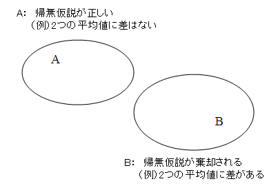

---
mathjax:
  presets: '\def\lr#1#2#3{\left#1#2\right#3}'
sidebarDepth: 2
---

# 記述統計

## 記述統計と推測統計

統計学は、以下の2つにわけられる(説明はざっくりしたもの)。

* 記述統計
手持ちのデータを集計する方法
* 推測統計
手持ちのデータを分析して、まだ手に入れていないデータについて議論する方法

推測統計学こそが、統計学において最も重要な部分。
記述統計学は、推測統計学の前処理に当たるものだと考えても構わない。
記述統計は知っておく必要はあるが、記述統計だけでは、データを社会の役に立たせることはできないことを意味する。

## 記述統計の必要性

記述統計だけでは、データを社会の役に立たせることはできない。
しかし、記述統計無しで推測統計を活用することもできない。

推測統計は「手持ちのデータを分析して、まだ手に入れていないデータについて議論する」方法。
そして、統計的予測理論においては「未来は過去と同じ」という前提のもと予測を行う。

以下の2つの予測を比較してみる。

1. 「気温が高いとビールが売れるというコトが1回だけあった」だから「今後、気温が高いとビールが良く売れる」
1. 「気温が高いとビールが売れるというコトが5万回もあった」だから「今後、気温が高いとビールが良く売れる」

どちらの予測のほうが信用できるかは、当然2のはず。多くのデータを使って予測した方が信用できる。
データが多いほうがよさそうというのは、容易に想像できるが、多くのデータを、一つ一つ分けて扱うのは面倒。

そこで重要なのが、データの **集計**。
データを集計することで、たくさんのデータを使っていたとしても、少数の集計値のみを対象として分析を進めることができるようになる。

なお、一回の調査で得られたデータの個数を、サンプルサイズと言う。
電子顕微鏡でリンゴの大きさを10個測れば、サンプルサイズは10。
15人にアンケートを取れば、サンプルサイズは15。
データを比較するときは、データの数も重要な要素となる(統計がたまるからね)。

## 標本と母集団

**母集団** は、統計的に分析することで、推測しようとしている対象物すべてのことをさす。
例えば、湖の中の特定の魚すべて。

我々が入手することができる実験データやアンケートは、**標本** と呼ばれるものに当たる。
標本は、母集団から一部のデータをランダムで取り出したものをさす。
意図的にデータを取り出すと、偏りが生じている可能性があり、本来の母集団を予測できなくなる。

## 不偏推定量

上記の例のように、湖の中にいる魚の全数検査をすることは難しいため、実際は標本データから母集団の推定を行う。
標本から母集団のことを推定することを不偏推定量と呼ぶ。
標本、母集団、不偏推定量を区別するために、以下のように表示記号を区別する。

### 標本

$n$: サンプル数
$x_{i}$: データの値(標本確率変数)

* **標本平均**

$$\bar{x} = \frac{1}{n}\sum^{n}_{i=1}x_{i}$$

* **標本分散**

「各データが期待値からどれほど離れているか(散らばっているか)」を表す指標。偏りを示してはいない。
分散= (データと期待値との距離)の期待値 と考えるとわかりやすい。

$$s^{2} = \frac{1}{n}\sum^{n}_{i=1}(x_{i}-\bar{x})^{2}$$

* **標本標準偏差**

$$s = \sqrt{\frac{1}{n}\sum^{n}_{i=1}(x_{i}-\bar{x})^{2}}$$

### 母集団

* **母平均**
ギリシャ文字の$\mu$を使って表す。
世の中に存在する全てのサンプルの平均をとることになるので、一般にこの値は未知となる。

$$\mu = \frac{1}{N}\sum^{N}_{i=1}x_{i}$$

* **母分散**
母分散も母平均同様、一般に未知。

$$\sigma^{2} = \frac{1}{N}\sum^{n}_{i=1}(x_{i}-\mu)^{2}$$

* **母標準偏差**
母標準偏差も母平均同様、一般に未知。

$$\sigma = \sqrt{\frac{1}{N}\sum^{n}_{i=1}(x_{i}-\mu)^{2}}$$

### 母集団の不偏推定量

上記のように一般に母集団の平均、分散、標準偏差は未知なので、母集団の不偏推定量を、標本から推定することが重要になる。
すなわち、標本データから算出できる値を採用して、推定する。

* **(標本)不偏平均**
標本分散は、標本データの分散を論じる場合に用いられるが、 標本から母分散を推測するときに標本分散を用いると、誤差が生じることがわかっている。
そこで、標本から母分散を推測するときには、次式の標本不偏分散が用いられる。

$$\hat{\mu} = \frac{1}{n}\sum^{n}_{i=1}x_{i} \\\\ = \bar{x}$$

* **(標本)不偏分散**

$$\hat{\sigma}^{2} = \frac{1}{n-1}\sum^{n}_{i=1}(x_{i}-\bar{x})^{2}$$

* **(標本)不偏標準偏差**

$$\hat{\sigma} = \sqrt{\frac{1}{n-1}\sum^{n}_{i=1}(x_{i}-\bar{x})^{2}}$$

不偏分散と不偏標準偏差の分母は、$n-1$となることに注意。

#### 不偏推定量の導出

不偏推定量を算出する際に、$n-1$で割る理由を端的に言うと、 標本平均のばらつきを考量するため 。
標本分散から母分散を推定する場合、母平均さえわかっていれば不偏統計量などを気にする必要はないが、
一般的に母集団の値すべてを調査・観測することは困難である。そのため，母平均の代わりに標本平均を使って不偏分散を計算することになる。
しかし、標本平均は分布するため、標本平均自身もバラツキを持っている。そこで、不偏分散を推定する場合、
標本分散に標本平均の分散(誤差分散 or 標準誤差の2乗)を加えた加えることで、ばらつきを補正し、不偏統計量を算出する。
誤差分散、標準誤差については、[標本と標本平均の分布](#_9)に詳しい。

$$
\begin{aligned}
&\ \sigma^{2} = \frac{1}{n}\sum^{n}_{i=1}(x_{i}-\bar{x})^{2}+\frac{\sigma^{2}}{n} \\
\Leftrightarrow&\ \sigma^{2}-\frac{\sigma^2}{n} =\frac{1}{n}\sum_{i=1}^{n}(x_i-\bar{x})^2 \\
\Leftrightarrow&\ \left(1-\frac{1}{n}\right)\sigma^{2} =\frac{1}{n}\sum_{i=1}^{n}(x_i-\bar{x})^2 \\
\Leftrightarrow&\ \frac{n-1}{n}\sigma^{2} =\frac{1}{n}\sum_{i=1}^{n}(x_i-\bar{x})^2 \\
\Leftrightarrow&\ \sigma^{2} =\frac{1}{n-1}\sum_{i=1}^{n}(x_i-\bar{x})^2 =\hat{\sigma}^{2}
\end{aligned}
$$

## 標本と標本平均の分布

何回かにわけてある標本データを採取した場合、各々の標本データの平均自体も分布する(ばらつく)。
ここで、標本の分布と標本平均の分布には下図のような重要な関係がある。

標本平均の分布は、 母分散が既知、もしくは標本サイズが大規模(n=50程度以上)の場合、 <u>標本平均の標準偏差</u> が母標準偏差の$1/\sqrt{n}$倍した値をもつ分布をとる。
この標本平均の標準偏差のことを 標準誤差 と呼び、標本平均の分散のことを 誤差分散 と呼ぶ。
これらの値は、母集団からある数の標本を選ぶとき、選ぶ組み合わせに依って統計量がどの程度ばらつくかを表す指標であり、
以下の式に表されるように、分母に$n$の項が含まれるため、データが多ければ多いほど、ばらつきが小さくなる。

* **母集団の総数が十分に大きい、もしくは母分散が既知の場合**

$$\sigma_{\bar{x}}=\frac{\sigma}{\sqrt{n}}$$

* **母集団の総数が十分に大きくない、もしくは母分散が未知で、標本から推定する場合**

$$\hat{\sigma}_{\bar{x}}=\frac{\hat{\sigma}}{\sqrt{n}}=\frac{\sigma}{\sqrt{n-1}}$$

### 証明

標本平均の分散を計算すれば良い

$$
\begin{aligned}
V[\bar{x}]
&= V \left [\frac{1}{n} \sum^{n}_{i} x_{i} \right] \\
&= \frac{1}{n^{2}}V\left[\sum^{n}_{i} x_{i} \right] \\
&= \frac{1}{n^{2}}\sum^{n}_{i} V\left[ x_{i} \right] \\
\end{aligned}
$$

標本確率変数の分散は母分散に等しい、すなわち、

$$V\left[ x_{i} \right] = \sigma^{2}$$

であるので、

$$
\begin{aligned}
V[\bar{x}]
&= \frac{1}{n^{2}}\sum^{n}_{i} \sigma^{2} \\
&= \frac{1}{n^{2}}\cdot n\sigma^{2} \\
&= \frac{\sigma^{2}}{n}
\end{aligned}
$$

## 期待値

データを手に入れたとき、そこには数値が含まれていることが一般。その数値を全部そのまま扱おうとするのは面倒。
なので、そのデータを、要約した値を使いたい。その要約した値こそが期待値。

### 期待値の特徴

1. 期待値は、各値が大きければ大きいほど大きくなる。
1. 「大きな値」があったとしても、その「大きな値」の頻度が低ければ、期待値はあまり大きくならない。

気温の例でいえば、1により、暑い日があれば気温の期待値も大きくなることがわかる。
しかし、2により、100日中暑い日がたった1日しかないということであれば、気温の期待値はあまり高くならない。

大阪の気温を10回測定したデータと、東京の気温を10回測定したデータがあったとき、どちらのほうが気温が高いか、ということを調べようと思ったら、各々の気温の期待値を比較すればよい。
例えば、大阪の気温の期待値が30度で、東京の気温の期待値が25度だったとします。そしたら「大阪の方が暑い」と一瞬でわかる。
少なくとも20個のデータを全部見るよりかは楽。
ただし、本当の期待値の比較だけで、データを比較できたとは言えないこともあるので、あくまで指標のひとつと捉えるべき。

### 期待値の数理

$$\mu = \sum^{n}_{i=1}p_{i}x_{i}$$

$p_{i}$: あるデータが生じる確率
$x_{i}$: データの値
