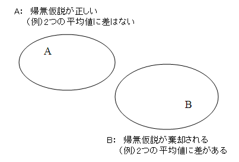

# 有意確率

## 説明

統計的仮説、特に帰無仮説が何を基準に(どのような値をもって)棄却されるか否かを判断すればよいか。現在ではコンピュータの発展に伴い、容易に<b>p値</b>を計算することができるようになったので、このp値を見ることによって直接的に判断することができる。

<b>p値</b>とは「帰無仮説が正しいという条件の下で、検定統計量の値より大きな値が得られる確率」のことである。 まず実験や調査によって得られる結果が常に正しいという場合、帰無仮説が正しいという事象をA、帰無仮説が棄却されるという事象をBとしてベン図で表現すると下図のようになる。これはAとBが決して交わらない、すなわち、どのような実験を行っても必ずAかBのどちらかしか起こりえないということを意味する。言い換えると、実験結果に決して過ちはないということである。しかし、現実にこのようなことは在りえないと考えるのが妥当で、AとBは少なからず交わることを前提として考えるべきである。


ではAとBが交わるとはどういうことだろうか。例えば、得られたp値が非常に小さい(p=0.01)場合、帰無仮説が正しいときに帰無仮説が棄却される確率が非常に小さいことを意味しており、AとBの交わる部分は非常に小さなものとなるだろう。逆に得られたp値が大きい(p=0.80)場合は帰無仮説が正しいときに帰無仮説が棄却される確率が高くなることを意味している。そしてAとBの交わる部分は大きなものとなるだろう。

これを言い方を変えると、p値とは「100回、同じ検定を行った場合に、そのうち??回は誤った結論を得る確率」ともいえる。先にあげた、p=0.01という値は「100回中1回は誤った結論を得る確率」といえる。だからp=0.80は「100回中80回は誤った結論を得る確率」といえる。

ここで問題となるのが「何回の失敗なら許容するか」ということである。この「帰無仮説が正しいのに、帰無仮説を棄却する」という過ちのことを第1種の過誤というが、第1種の過誤を犯す確率をどの程度までなら許容するか、という境界のことを有意水準という。この有意水準は検定を行う前に設定しておくべきもので、心理学では慣例的にα=0.05(5%水準)という値を採用することが多い。5%水準ということは、換言すると「100回に5回の誤りなら許容する」となる。

## まとめ
最後にまとめとして、例をあげてp値について説明する。  
**例題**  
男性と女性の身長を測り、それぞれの平均値を比較したい。そこで「男性と女性の平均値は等しい」という帰無仮説について、5%水準で検定したところ、p=0.01という値が得られた。

* 5%水準で検定を行うということは、100回のうち5回の誤りなら許容するということである。  
* p=0.01という値は、帰無仮説が正しいときに、帰無仮説を棄却する確率が0.01であるということである。言い換えると「差がない」という仮定の下で「差がある」という結論が得られる確率は非常に小さなものである、ということである。  
* 結論としてp=0.01はα=0.05よりも小さな値であるので、帰無仮説を棄却する。すなわち、男性と女性の平均値は異なる、ということが統計学的に認められた。
