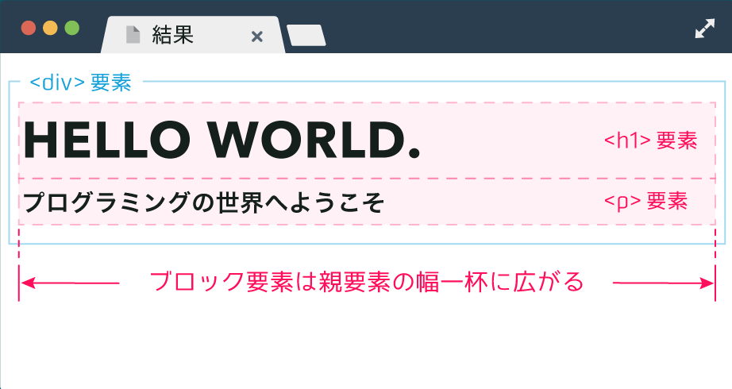
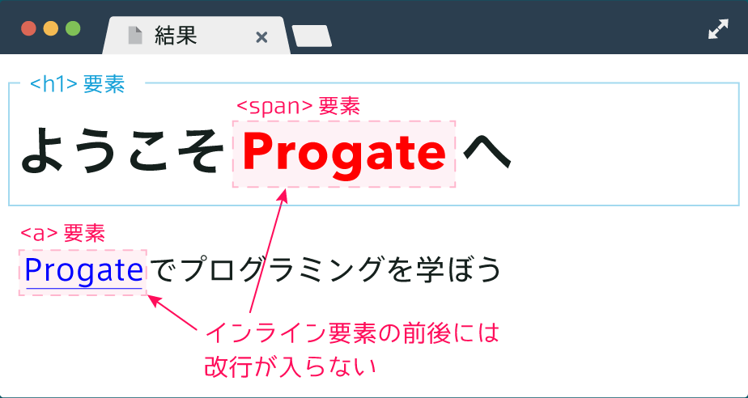
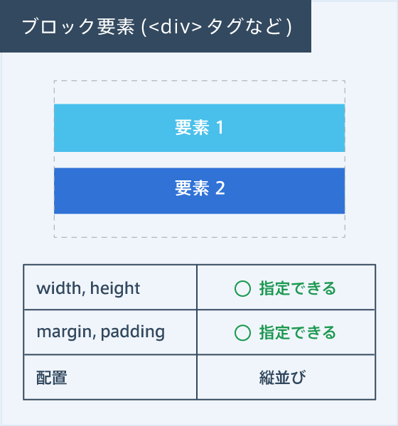
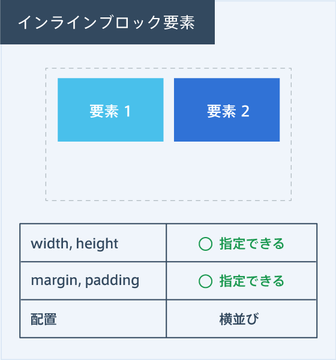
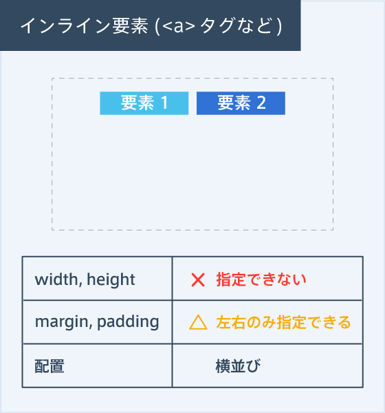

# inline-block

HTMLの要素には、改行される要素と改行されない要素がある。

## ブロック要素

前後で改行が入り、親要素の幅一杯に広がる要素をブロック要素と呼ぶ。
e.g.) `
`, `<h1>`, `
`

## インライン要素

一方で、改行されない要素をインライン要素
e.g.) `<a>`, ``

## インラインブロック要素

ブロック要素とインライン要素の特徴を併せ持つ要素。
インラインブロック要素はインライン要素と同様に横に並ぶが、ブロック要素のように幅や高さをもつ。

|block|inline-block|inline|
|-|-|-|
||||
