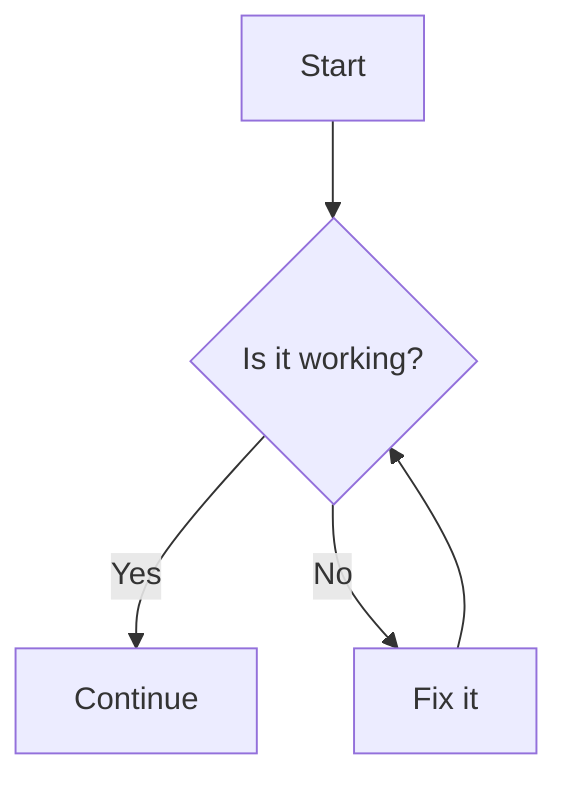
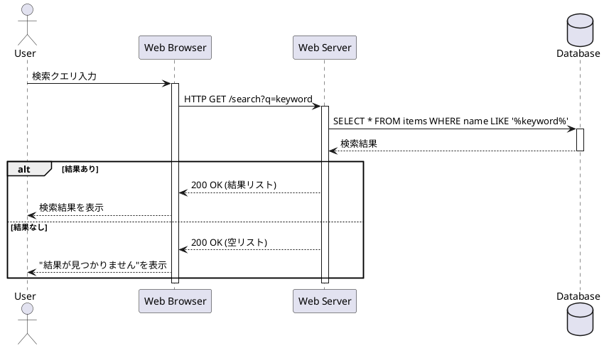

<!--_class: lead -->

# Sample

<!-- _paginate: false -->

## Marpで作成したスライド

@jyoppomu

# マークダウン記法

`<!--_class: lead -->` を`#`headingの前に追加するとタイトルページになります。
`<!-- _paginate: false -->` を`#`headingの後に追加するとページ番号が表示されなくなります。
`<!--fit-->` を`#`headingに含めるとそのheadingが画面全体に拡大されます。

# リンク

このスライドは[aYukiYoshida/tips](https://github.com/aYukiYoshida/tips)のリポジトリで管理しています。

# リスト

## 箇条書きリスト

- 項目1
- 項目2
- 項目3
  - サブ項目1
  - サブ項目2

## 順序付きリスト

1. 項目1
1. 項目2
   1. サブ項目1
   1. サブ項目2
1. 項目3

# 文字の色

:::c
==white=={.white}
==black=={.black}
==gray=={.gray}
==red=={.red}
==blue=={.blue}
==light-blue=={.light-blue}
==green=={.green}
==yellow=={.yellow}
==orange=={.orange}
==purple=={.purple}

```markdown
==white=={.white}
==black=={.black}
==gray=={.gray}
==red=={.red}
==blue=={.blue}
==light-blue=={.light-blue}
==green=={.green}
==yellow=={.yellow}
==orange=={.orange}
==purple=={.purple}
```

:::

# 文字の大きさ

:::c
==xl5=={.text-xl5}
==xl4=={.text-xl4}
==xl3=={.text-xl3}
==xl2=={.text-xl2}
==xl=={.text-xl}
==lg=={.text-lg}
==sm=={.text-sm}
==xs=={.text-xs}
==xs2=={.text-xs2}
==xs3=={.text-xs3}

```markdown
==xl5=={.text-xl5}
==xl4=={.text-xl4}
==xl3=={.text-xl3}
==xl2=={.text-xl2}
==xl=={.text-xl}
==lg=={.text-lg}
==sm=={.text-sm}
==xs=={.text-xs}
==xs2=={.text-xs2}
==xs3=={.text-xs3}
```

:::

# 画像

:::c


```markdown

```

:::

# Note

:::c
これは情報です。{.note}

```markdown
これは情報です。{.note}
```

:::

# Tip

:::c
これは補足です。{.tip}

```markdown
これは補足です。{.tip}
```

:::

# Important

:::c
これは重要です。{.important}

```markdown
これは重要です。{.important}
```

:::

# Warning

:::c

これは注意です。{.warning}

```markdown
これは注意です。{.warning}
```

:::

# Caution

:::c
これは警告です。{.caution}

```markdown
これは警告です。{.caution}
```

:::

# Mermaid



# PlantUML



# カラムレイアウト

```markdown
:::c
ここに1列目の内容を書きます。
空行によって分割します。

ここに2列目の内容を書きます。

ここに3列目の内容を書きます。
:::
```

:::c
ここに1列目の内容を書きます。
空行によって分割します。

ここに2列目の内容を書きます。

ここに3列目の内容を書きます。
:::
